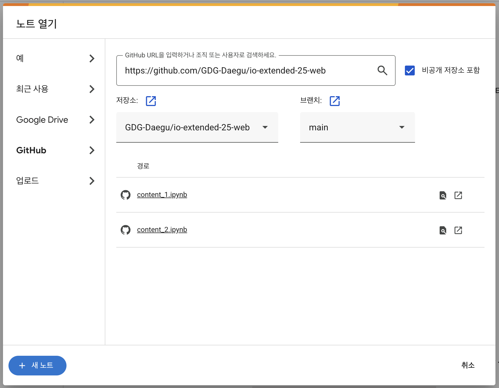

# io-extended-25-web
Google I/O Extended in Uiseong 2025 핸즈온 세션

## 🌐 웹 세션: 풀스택 바이브 코딩 (총 2시간)

**세션 목표:** Gemini를 활용해 웹 개발의 초기 아이디어 구상부터 코드 작성, 디자인 개선, 그리고 배포까지 전 과정을 경험합니다. Builder.io와 같은 최신 툴을 통해 생산성을 극대화하는 방법을 학습합니다.

### **사전 준비사항**

[실습 준비하기](./PREPARE.md) 페이지에서 실습에 필요한 모든 준비를 마쳐주세요.

### **실습 콘텐츠**

아래 링크는 실제 세션에서 사용할 Google Colab 파일입니다. 참가자들은 링크에 접속하여 코드를 직접 실행하며 실습을 진행하게 됩니다.

**[➡️ WEB 세션 실습](https://colab.research.google.com/)**

링크에 접속하여 GitHub 저장소에서 content.ipynb 파일을 열어주세요.

